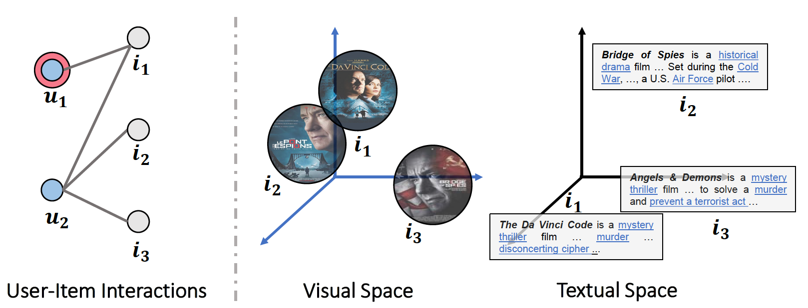

# Awesome Multi-Modal Recommendation

 [](https://awesome.re)     

A curated list of awesome Multi-modal Recommendation resources. Inspired by [awesome-deep-vision](https://github.com/kjw0612/awesome-deep-vision), [awesome-adversarial-machine-learning](https://github.com/yenchenlin/awesome-adversarial-machine-learning), [awesome-deep-learning-papers](https://github.com/terryum/awesome-deep-learning-papers), [awesome-architecture-search](https://github.com/markdtw/awesome-architecture-search), [awesome-self-supervised-learning](https://github.com/jason718/awesome-self-supervised-learning), [awesome-self-supervised-learning-for-graphs](https://github.com/SXKDZ/awesome-self-supervised-learning-for-graphs), [GNNPapers](https://github.com/juyongjiang/GNNPapers) ,[awesome-graph-self-supervised-learning-based-recommendation](https://github.com/juyongjiang/awesome-graph-self-supervised-learning-based-recommendation), and [awesome-multimodal-ml](https://github.com/pliang279/awesome-multimodal-ml).

## Introduction
With the explosive growth of the amount of information on the Internet, recommender systems play a crucial role to alleviate the problem of information overload. To achieve higher quality and personalized recommendation service, it is of crucial importance to consider the transition between users and items as well as the item contents or attributes from various modalities (e.g., visual, acoustic, and textual). 

<p align="center">
  
  <br>
  <b>Figure 1.</b> Multi-modal Recommendation. [Source Image from paper [MMGCN: Multi-modal Graph Convolution Network for Personalized Recommendation of Micro-video](http://staff.ustc.edu.cn/~hexn/papers/mm19-MMGCN.pdf)]
</p>

## Contributing

Please, feel free to send [pull requests](https://github.com/juyongjiang/awesome-graph-based-recommendation/pulls) to add more resources!

Markdown Format:

```markdown
- Paper Name. [[PDF]](link) [[Code]](link)
  Author 1, Author 2, and Author 3. 
  *Conference Year*
```

## Table of Contents

* [Multi-modal Recommendation](#papers)
  * [Surveys](#surveys) | [2021](#2021) | [2020](#2020) | [2019](#2019) | [2018-](#2018)

## Graph-based Recommendation

### Surveys
* Multi-Modal Recommender Systems: Hands-On Exploration [[PDF]](https://dl.acm.org/doi/10.1145/3460231.3473324)

  Truong, Quoc-Tuan, Aghiles Salah, and Hady Lauw

  *RecSys 2021*

* Multimodal Co-learning: Challenges, Applications with Datasets, Recent Advances and Future Directions [[PDF]](https://arxiv.org/abs/2107.13782)
  
  Anil Rahate, Rahee Walambe, Sheela Ramanna, Ketan Kotecha

  *arXiv 2021*

### 2021
* Multi-Modal Recommender Systems: Hands-On Exploration [[PDF]](https://dl.acm.org/doi/10.1145/3460231.3473324)

  Truong, Quoc-Tuan, Aghiles Salah, and Hady Lauw

  *RecSys 2021*

* Parameter Efficient Multimodal Transformers for Video Representation Learning [[PDF]](https://openreview.net/forum?id=6UdQLhqJyFD)
  
  Sangho Lee, Youngjae Yu, Gunhee Kim, Thomas Breuel, Jan Kautz, Yale Song

  *ICLR 2021 (Poster)*

* MultiHead MultiModal Deep Interest Recommendation Network [[PDF]](https://arxiv.org/abs/2110.10205)

  Mingbao Yang, ShaoBo Li, Zhou Peng, Ansi Zhang, Yuanmeng Zhang

  *CIKM 2021*

* Click-Through Rate Prediction with Multi-Modal Hypergraphs [[PDF]](https://arxiv.org/abs/2109.02398)

  Li He, Hongxu Chen, Dingxian Wang, Jameel Shoaib, Philip Yu, Guandong Xu

  *CIKM 2021*

### 2020
* PinnerSage: Multi-Modal User Embedding Framework for Recommendations at Pinterest [[PDF]](https://cs.stanford.edu/people/jure/pubs/pinnersage-kdd20.pdf)

  Aditya Pal, Chantat Eksombatchai, Yitong Zhou, Bo Zhao, Charles Rosenberg, Jure Leskovec

  *KDD 2020*

* Multimodal Topic Learning for Video Recommendation [[PDF]](https://arxiv.org/abs/2010.13373)

  Pu, Shi, Yijiang He, Zheng Li, and Mao Zheng

  *arXiv 2020*

* Multi-modal Knowledge Graphs for Recommender Systems [[PDF]](https://zheng-kai.com/paper/cikm_2020_sun.pdf)

  Sun, Rui, Xuezhi Cao, Yan Zhao, Junchen Wan, Kun Zhou, Fuzheng Zhang, Zhongyuan Wang, and Kai Zheng

  *CIKM 2020*

* User Conditional Hashtag Recommendation for Micro-Videos [[PDF]](https://ieeexplore.ieee.org/document/9102824)

  Shang Liu, Jiayi Xie, Cong Zou, Zhenzhong Chen

  *ICME 2020*


### 2019
* Neural Multimodal Cooperative Learning Toward Micro-Video Understanding

  Wei, Yinwei, Xiang Wang, Weili Guan, Liqiang Nie, Zhouchen Lin, and Baoquan Chen

  *TIP 2019*

* Joint Representation Learning for Multi-Modal Transportation Recommendation [[PDF]](https://ojs.aaai.org/index.php/AAAI/article/view/3894)

  Hao Liu, Ting Li, Renjun Hu, Yanjie Fu, Jingjing Gu, Hui Xiong

  *AAAI 2019*

* MMGCN: Multi-modal Graph Convolution Network for Personalized Recommendation of Micro-video [[PDF]](http://staff.ustc.edu.cn/~hexn/papers/mm19-MMGCN.pdf)

  Wei, Yinwei, Xiang Wang, Liqiang Nie, Xiangnan He, Richang Hong, and Tat-Seng Chua

  *ACM MM 2019*

* Multi-modal Representation Learning for Successive POI Recommendation [[PDF]](http://proceedings.mlr.press/v101/li19a.html)

  Lishan Li, Ying Liu, Jianping Wu, Lin He, Gang Ren

  *ACML 2019*

* Personalized Hashtag Recommendation for Micro-videos [[PDF]](https://arxiv.org/pdf/1908.09987.pdf)

  Yinwei Wei, Zhiyong Cheng, Xuzheng Yu, Zhou Zhao, Lei Zhu, Liqiang Nie

  *ACM MM 2019*

### 2017
* Hashtag Recommendation for Multimodal Microblog Using Co-Attention Network [[PDF]](https://www.ijcai.org/proceedings/2017/0478.pdf)

  Qi Zhang, Jiawen Wang, Haoran Huang, Xuanjing Huang, Yeyun Gong

  *IJCAI 2017*